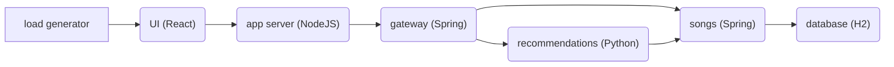

# SkyWalking showcase

This showcase repository includes an example music application and other manifests to demonstrate the main features of
SkyWalking. The music application is composed of several microservices that are written in different programming
languages. Here is the architecture:



## Usage

The showcase uses [GNU Make](https://www.gnu.org/software/make/) and Docker containers to run commands, so please make
sure you have `make` installed and Docker daemon running.

### Prerequisites

To deploy the full features of this showcase application, you may need up to 4 CPU cores and 4 GB memory, please
increase the Docker daemon resources or Kubernetes cluster resources if you find containers / Pods failed to start up.
Alternatively, you can also only deploy part of the features that interest you if you don't want to increase the
resources, via the guide in [Customization](#customization).

### Quick Start

Make sure you have a running Kubernetes cluster and `kubectl` can access to that cluster.

```shell
git clone https://github.com/apache/skywalking-showcase.git
cd skywalking-showcase
make deploy.kubernetes
```

This will install SkyWalking components, including OAP in cluster mode with 2 nodes, SkyWalking RocketBot UI,
microservices with SkyWalking agent, microservices without SkyWalking agent but managed by Istio, 
2 Pods to mimic virtual machines and export metrics to SkyWalking, and enable kubernetes cluster monitoring as well as 
SkyWalking self observability.

For more advanced deployments, check [Customization](#customization) documentation below.

Notice, when run this showcase locally such as KinD, the images are downloaded inside the KinD, which could take over 10 mins(depend on local network).
Rerun `make deploy.kubernetes` if some timeout errors break the process.

### Customization

The variables defined in [`Makefile.in`](../Makefile.in) can be overridden to customize the showcase, by specifying an
environment variable with the same name, e.g.:

```shell
export ES_VERSION=7.14.0
make <target>
```

or directly specifying in the `make` command, e.g.: `make <target> ES_VERSION=7.14.0`.

Run `make help` to get more information.

### Features

The showcase is composed of a set of scenarios with feature flags, you can deploy some of them that interest you by
overriding the `FEATURE_FLAGS` variable defined in [`Makefile.in`](../Makefile.in), as documented
in [Customization](#customization), e.g.:

```shell
make deploy.kubernetes FEATURE_FLAGS=single-node,agent
```

Feature flags for different platforms ([Kubernetes](#kubernetes) and [Docker Compose](#docker-compose)) are not
necessarily the same so make sure to specify the right feature flags.

Currently, the features supported are:

| Name          | Description | Note |
| -----------   | ----------- | ----------- |
| `agent`       | Deploy microservices with SkyWalking agent enabled. | The microservices include agents for Java, NodeJS server, browser, Python. |
| `cluster`     | Deploy SkyWalking OAP in cluster mode, with 2 nodes, and SkyWalking RocketBot UI, ElasticSearch as storage. | Only one of `cluster` or `single-node` can be enabled. |
| `single-node` | Deploy only one single node of SkyWalking OAP, and SkyWalking RocketBot UI, ElasticSearch as storage. | Only one of `cluster` or `single-node` can be enabled. |
| `so11y`       | Enable SkyWalking self observability. | This is enabled by default for platform [Docker Compose](#docker-compose). |
| `vm`          | Start 2 virtual machines and export their metrics to SkyWalking. | The "virtual machines" are mimicked by Docker containers or Pods. |
| `als`         | Start microservices WITHOUT SkyWalking agent enabled, and configure SkyWalking to analyze the topology and metrics from their access logs. | Command `istioctl` is required to run this feature. The agentless microservices will be running at namespace `${NAMESPACE}-agentless` |
| `kubernetes-monitor` | Deploy OpenTelemetry and export Kubernetes monitoring metrics to SkyWalking for analysis and display on UI. | |
| `istiod-monitor`     | Deploy OpenTelemetry and export Istio control plane metrics to SkyWalking for analysis and display on UI. | |
| `event`       | Deploy tools to trigger events, and SkyWalking Kubernetes event exporter to export events into SkyWalking. | |

### Kubernetes

To deploy the example application in Kubernetes, please make sure that you have `kubectl` command available, and it can
connect to the Kubernetes cluster successfully.

If you don't have a running cluster, you can also leverage [KinD (Kubernetes in Docker)](https://kind.sigs.k8s.io)
or [minikube](https://minikube.sigs.k8s.io) to create a cluster.

Run `kubectl get nodes` to check the connectivity before going to next step. The typical error message that indicates
your `kubectl` cannot connect to a cluster is:

```text
The connection to the server localhost:8080 was refused - did you specify the right host or port?
```

#### Deploy

```shell
# Deploy
make deploy.kubernetes
# Undeploy
make undeploy.kubernetes
# Redeploy
make redeploy.kubernetes # equivalent to make undeploy.kubernetes deploy.kubernetes
```

### Docker Compose

#### Deploy

```shell
# Deploy
make deploy.docker
# Undeploy
make undeploy.docker
# Redeploy
make redeploy.docker # equivalent to make undeploy.docker deploy.docker
```
