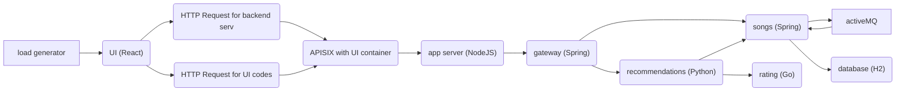
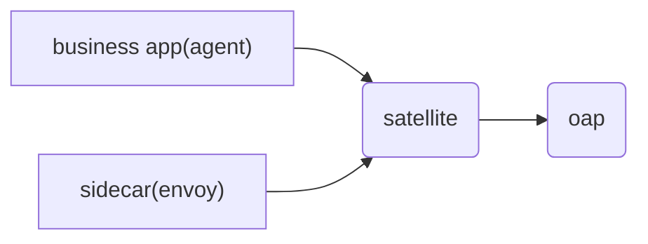

# SkyWalking 10.x showcase

**This showcase would follow the latest changes of SkyWalking 10.x, even before the official release.**

This showcase repository includes an example music application and other manifests to demonstrate the main features of
SkyWalking. The music application is composed of several microservices that are written in different programming
languages. Here is the architecture:



## Usage

**Please run the showcase in a brand new test cluster, otherwise the undeploy process may delete
some resources that you have installed before running this showcase (for example cert-manager).
If you don't do this in a new test cluster, it's all on your own risks!**

The showcase uses [GNU Make](https://www.gnu.org/software/make/) and Docker containers to run commands, so please make
sure you have `make` installed and Docker daemon running.

### Prerequisites

To deploy the full features of this showcase application, you may need up to 8 CPU cores and 32 GB memory, please
increase the Docker daemon resources or Kubernetes cluster resources if you find containers / Pods failed to start up.
Alternatively, you can also only deploy part of the features that interest you if you don't want to increase the
resources, via the guide in [Customization](#customization).

### Quick Start

Make sure you have a running Kubernetes cluster and `kubectl` can access to that cluster.

```shell
git clone https://github.com/apache/skywalking-showcase.git
cd skywalking-showcase
make deploy.kubernetes
```

This will install SkyWalking components, including OAP in cluster mode with 2 nodes, SkyWalking UI,
microservices with SkyWalking agent, microservices without SkyWalking agent but managed by Istio,
2 Pods to mimic virtual machines and export metrics to SkyWalking, and enable kubernetes cluster monitoring as well as
SkyWalking self observability.

For more advanced deployments, check [Customization](#customization) documentation below.

Notice, when run this showcase locally such as KinD, the images are downloaded inside the KinD, which could take over 10 mins(depend on local network).
Rerun `make deploy.kubernetes` if some timeout errors break the process.

### Customization

The variables defined in [`Makefile.in`](../Makefile.in) can be overridden to customize the showcase, by specifying an
environment variable with the same name, e.g.:

```shell
export ES_VERSION=7.14.0
make <target>
```

or directly specifying in the `make` command, e.g.: `make <target> ES_VERSION=7.14.0`.

Run `make help` to get more information.

### Features

The showcase is composed of a set of scenarios with feature flags, you can deploy some of them that interest you by
overriding the `FEATURE_FLAGS` variable defined in [`Makefile.in`](../Makefile.in), as documented
in [Customization](#customization), e.g.:

```shell
make deploy.kubernetes FEATURE_FLAGS=single-node,agent
```

Feature flags for different platforms ([Kubernetes](#kubernetes) and [Docker Compose](#docker-compose)) are not
necessarily the same so make sure to specify the right feature flags.

Currently, the features supported are:

| Name                    | Description                                                                                                                                                                            | Note                                                                                                                                  |
|-------------------------|----------------------------------------------------------------------------------------------------------------------------------------------------------------------------------------|---------------------------------------------------------------------------------------------------------------------------------------|
| `java-agent-injector`   | Use the java agent injector to inject the Skywalking Java agent and deploy microservices with other SkyWalking agent enabled.                                                          | The microservices include agents for Java, NodeJS server, browser, Python.                                                            |
| `agent`                 | Deploy microservices with SkyWalking agent pre-installed.                                                                                                                              | In Kubernetes scenarios, please use `java-agent-injector` instead of this, if possible.                                               |
| `cluster`               | Deploy SkyWalking OAP in cluster mode, with 2 nodes, and SkyWalking UI.                                                                                                                | Only one of `cluster` or `single-node` can be enabled.                                                                                |
| `single-node`           | Deploy only one single node of SkyWalking OAP, and SkyWalking UI, ElasticSearch as storage.                                                                                            | Only one of `cluster` or `single-node` can be enabled.                                                                                |
| `elasticsearch`         | Deploy ElasticSearch as storage, you may want to disable this if you want to use your own ElasticSearch deployments.                                                                   |                                                                                                                                       |
| `postgresql`            | Deploy PostgreSQL as storage, you may want to disable this if you want to use your own PostgreSQL deployments.                                                                         |                                                                                                                                       |
| `so11y`                 | Enable SkyWalking self observability.                                                                                                                                                  | This is enabled by default for platform [Docker Compose](#docker-compose).                                                            |
| `vm-monitor`            | Start 2 virtual machines and export their metrics to SkyWalking.                                                                                                                       | The "virtual machines" are mimicked by Docker containers or Pods.                                                                     |
| `als`                   | Start microservices WITHOUT SkyWalking agent enabled, and configure SkyWalking to analyze the topology and metrics from their access logs.                                             | Command `istioctl` is required to run this feature. The agentless microservices will be running at namespace `${NAMESPACE}-agentless` |
| `kubernetes-monitor`    | Deploy OpenTelemetry and export Kubernetes monitoring metrics to SkyWalking for analysis and display on UI.                                                                            |                                                                                                                                       |
| `istiod-monitor`        | Deploy OpenTelemetry and export Istio control plane metrics to SkyWalking for analysis and display on UI.                                                                              |                                                                                                                                       |
| `event`                 | Deploy tools to trigger events, and SkyWalking Kubernetes event exporter to export events into SkyWalking.                                                                             |                                                                                                                                       |
| `satellite`             | Deploy SkyWalking Satellite to load balance the monitoring data.                                                                                                                       |                                                                                                                                       |
| `trace-profiling`       | Deploy tools to submit trace profiling tasks.                                                                                                                                          | Only support deployment with SkyWalking agents installed, currently Java agent and Python agent support trace profiling.              |
| `rover`                 | Deploy SkyWalking Rover and detect the processes in the Kubernetes environment.                                                                                                        | Only support deployment in the Kubernetes environment, docker is not supported.                                                       |
| `mysql-monitor`         | Start a MySQL server and load generator to execute the sample SQLs periodically, set up fluent bit to fetch slow logs and export to OAP, and export their metrics to SkyWalking.       |                                                                                                                                       |
| `postgresql-monitor`    | Start a PostgreSQL server, and load generator to execute the sample SQLs periodically, set up fluent bit to fetch slow logs and export to OAP, and export their metrics to SkyWalking. |                                                                                                                                       |
| `elasticsearch-monitor` | Deploy OpenTelemetry and export Elasticsearch monitoring metrics to SkyWalking for analysis and display on UI.                                                                         |                                                                                                                                       |
| `mongodb-monitor`       | Deploy OpenTelemetry and export MongoDB monitoring metrics to SkyWalking for analysis and display on UI.                                                                               |                                                                                                                                       |
| `nginx-monitor`         | Deploy OpenTelemetry and export Nginx metrics and logs to SkyWalking for analysis and display on UI                                                                                    |                                                                                                                                       |
| `apisix-monitor`        | Deploy OpenTelemetry and export APISIX metrics to SkyWalking for analysis and display on UI                                                                                            |                                                                                                                                       |
| `mesh-with-agent`       | Deploy services with java agent in the service mesh environment.                                                                                                                       | Only support deployment in the Kubernetes environment, docker is not supported.                                                       |
| `grafana`               | Deploy a Grafana to show SkyWalking metrics and logs on the Grafana UI.                                                                                                                | Feel free to modify the Grafana config when deploy your own environment.                                                              |
| `r3`                    | Deploy [R3](https://github.com/SkyAPM/R3) as RESTful URL recognition service.                                                                                                          |                                                                                                                                       |
| `rocketmq-monitor`      | Deploy OpenTelemetry and export RocketMQ monitoring metrics to SkyWalking for analysis and display on UI.                                                                              |                                                                                                                                       |
| `pulsar-monitor`        | Deploy OpenTelemetry and export Pulsar monitoring metrics to SkyWalking for analysis and display on UI.                                                                                |                                                                                                                                       |
| `rabbitmq-monitor`      | Deploy OpenTelemetry and export RabbitMQ monitoring metrics to SkyWalking for analysis and display on UI.                                                                              |                                                                                                                                       |
| `activemq-monitor`      | Deploy OpenTelemetry and export [ActiveMQ classic](https://activemq.apache.org/components/classic/) monitoring metrics to SkyWalking for analysis and display on UI.                   |                                                                                                                                       |
| `cilium`                | Deploy Cilium and showcase services in a separate namespace, SkyWalking fetch Cilium Services Traffic to analysis and display on UI.                                                   | Only support deployment in the Kubernetes environment, docker is not supported.                                                       |
| `baseline`              | Deploy [SkyPredictor](https://github.com/SkyAPM/SkyPredictor) as baseline calculator to predict metrics.                                                                               | Only support deployment in the Kubernetes environment, docker is not supported.                                                       |

### Kubernetes

To deploy the example application in Kubernetes, please make sure that you have `kubectl` command available, and it can
connect to the Kubernetes cluster successfully.

If you don't have a running cluster, you can also leverage [KinD (Kubernetes in Docker)](https://kind.sigs.k8s.io)
or [minikube](https://minikube.sigs.k8s.io) to create a cluster.

Run `kubectl get nodes` to check the connectivity before going to next step. The typical error message that indicates
your `kubectl` cannot connect to a cluster is:

```text
The connection to the server localhost:8080 was refused - did you specify the right host or port?
```

#### Deploy

```shell
# Deploy
make deploy.kubernetes
# Undeploy
make undeploy.kubernetes
# Redeploy
make redeploy.kubernetes # equivalent to make undeploy.kubernetes deploy.kubernetes
```

### Docker Compose

#### Deploy

```shell
# Deploy
make deploy.docker
# Undeploy
make undeploy.docker
# Redeploy
make redeploy.docker # equivalent to make undeploy.docker deploy.docker
```

## Traffic Flow

After deploy the showcase, the business system would send monitoring traffic to the OAP node, and one agent/sidecar connect to one OAP node directly.

### Satellite
If the business traffic is unbalanced, it would cause the OAP node receive unbalanced monitoring data. So, you could add the Satellite component.
After deploy the showcase with the satellite component, the monitoring traffic would send to the Satellite service, and satellite
load balances the traffic to the OAP nodes.



## Troubleshooting

If you encounter any problems, please add `DEBUG=true` to the command line to get the output of the resources that will be applied.

```shell
make deploy.kubernetes DEBUG=true # this will print the resources that will be applied to Kubernetes
```

```shell
make deploy.docker DEBUG=true # this will print the merged docker-compose.yaml content that will be used to run in Docker Compose
```
